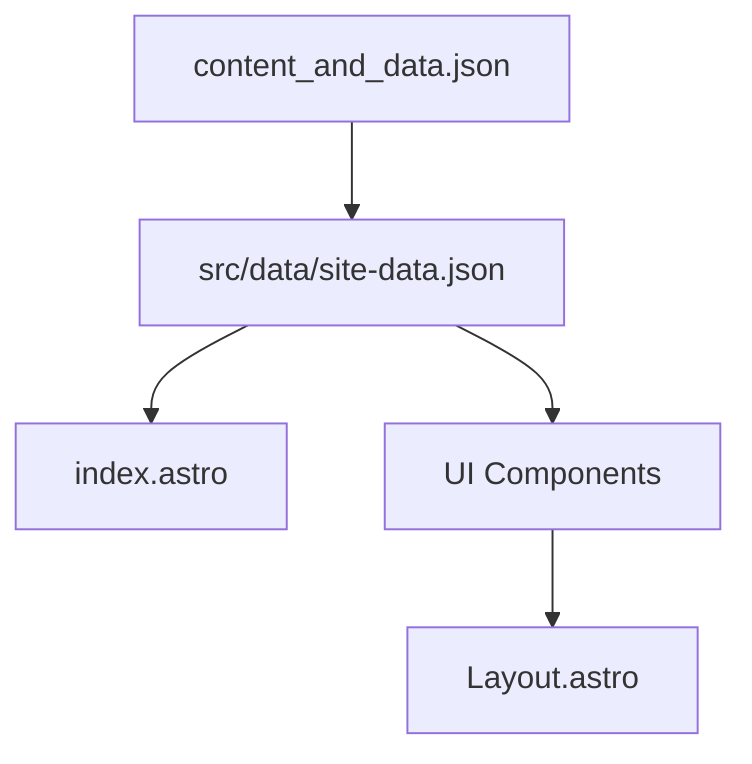

# Architecture Guide

Purpose: how the Astro app is structured, how data flows, and where islands belong. Use with `docs/preparation.md`, `docs/implementation-plan.md`, `docs/styling-plan.md`, and `README_DevPlan.md`.

## Project structure (target)
- `src/pages/index.astro` → main page consuming data.
- `src/layouts/Layout.astro` → global shell (dark base `#0a0a0a`, text `#f5f5f5`, font imports, SEO meta).
- `src/components/` → Navbar, Hero, ValueProp, AboutProducer, ServicesGrid, GearList, Amenities, ContactForm, Footer.
- `src/data/site-data.json` → copy + gear/services; derived from root `content_and_data.json`.
- `public/` → images, branding/logo.svg, audio/demo-reel.mp3.

## Data flow
- Root source: `content_and_data.json` (checked into repo). Copy into `src/data/site-data.json` for runtime use.
- Components import the data file and receive typed slices (e.g., `site_info`, `sections.services`, `gear_inventory.categories`).
- Keep copy edits in JSON; avoid hardcoded strings in components.

## Islands and hydration
- Default to static rendering. Use islands only where needed (e.g., Intersection Observer for staggered card animations, optional Brevo/Netlify form handlers).
- Import Lucide icons per-component to keep bundles small; avoid global CDN scripts.

## Component map
- Layout: wraps all content, sets global meta, fonts, theme colors, motion keyframes.
- Navbar: anchors to sections; booking CTA → EngineEars.
- Hero: pulls `sections.hero`; uses background image/gradient.
- ValueProp: `sections.value_prop`.
- AboutProducer: `sections.about_producer`.
- ServicesGrid: `sections.services[]`.
- GearList: `gear_inventory.categories[]`.
- Amenities: `sections.amenities[]`.
- ContactForm: Netlify form attrs; optional Brevo follow-up handled server-side or via island.
- Footer: booking + contact info from `site_info`.

## Theming references
- Base background: `#0a0a0a`.
- Text: `#f5f5f5`.
- Accents: emerald/blue/purple/orange as in `docs/styling-plan.md`.
- Reuse tokens from Tailwind v4 config; avoid inline hardcoded colors when a token exists.

## Cross-links
- Build steps: see `docs/implementation-plan.md`.
- Styling rules: see `docs/styling-plan.md`.
- Prep and constraints: see `docs/preparation.md`.

